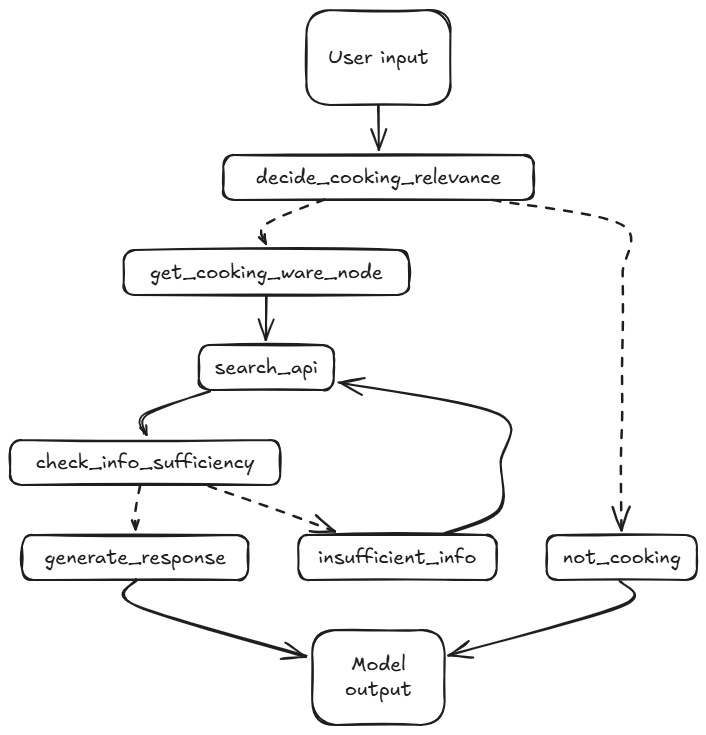

# Cooking Assistant API

A FastAPI-based cooking assistant that uses LLMs and tools to answer cooking-related queries. This repository implements the technical assessment defined in [ASSESMENT_DEFINITION.md](ASSESMENT_DEFINITION.md), creating an AI-powered recipe chatbot using LangGraph and FastAPI.

## Overview

The application uses a graph-based agent architecture  to process cooking queries through a series of specialized nodes:

### Features
- 🤖 **Query Classification**: Uses LLM to intelligently identify cooking-related queries
- 🔍 **Smart Research**: Integrates SERP API for recipe and cooking technique search
- 🍳 **Equipment Awareness**: Tracks available cooking equipment to ensure practical responses
- 📝 **Structured Responses**: Generates clear, step-by-step cooking instructions
- 🔄 **Information Sufficiency**: Dynamically determines if more research is needed
- ⚡ **Modern Stack**:
  - FastAPI for high-performance API endpoints
  - SERP API search therecipe and cooking technique 
  - LangGraph for flexible agent orchestration
  - UV for optimized Python execution
  - Docker for containerized deployment



## Setup

1. Create a virtual environment and install dependencies:
```bash
make install
```

## Running the API

1. Make sure your virtual environment is activated
2. Run the API server:
```bash
env $(cat .env | xargs) uv run app/app.py
```

## Running with Docker

1. Build the Docker image:
```bash
env $(cat .env | xargs) docker compose  --env-file .env up
```

## API Endpoints

### POST /api/cooking
Submit a cooking-related query:
```bash
curl -X POST "http://localhost:8080/api/cooking" \
     -H "Content-Type: application/json" \
     -d '{"query": "How do I make pasta?"}'
```

### GET /
Get API information:
```bash
curl "http://localhost:8080/"
```

### How to use the API

1. Run the API server:
```bash
env $(cat .env | xargs) uv run app/app.py
```

2. Use the API with interactive API documentation by visiting:
- Docs UI: http://localhost:8080/docs

